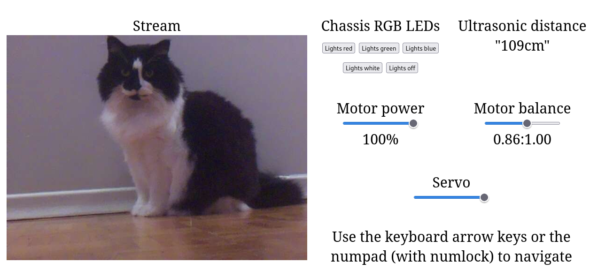
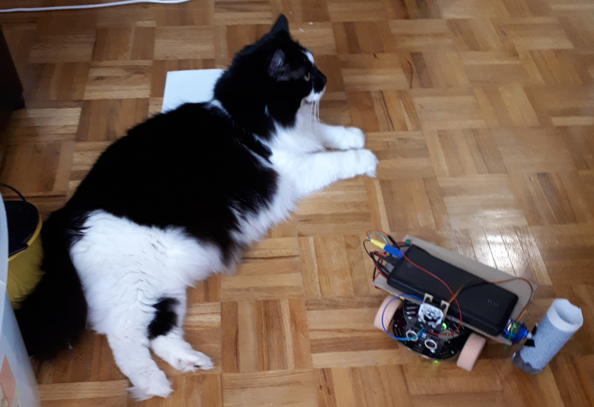

# Trilobot Controls

## Three examples of controls

I've split the three examples apart

* Really basic [console controls](./ssh/) that can be used over SSH
* A [PyQt GUI](./pyqt/) that communicates from a desktop PC to an API on the Trilobot
* A [web server](./web_gui/) that offers desktop and mobile controls on a local website

## Sample

## ~~Cat~~ Robot tax

