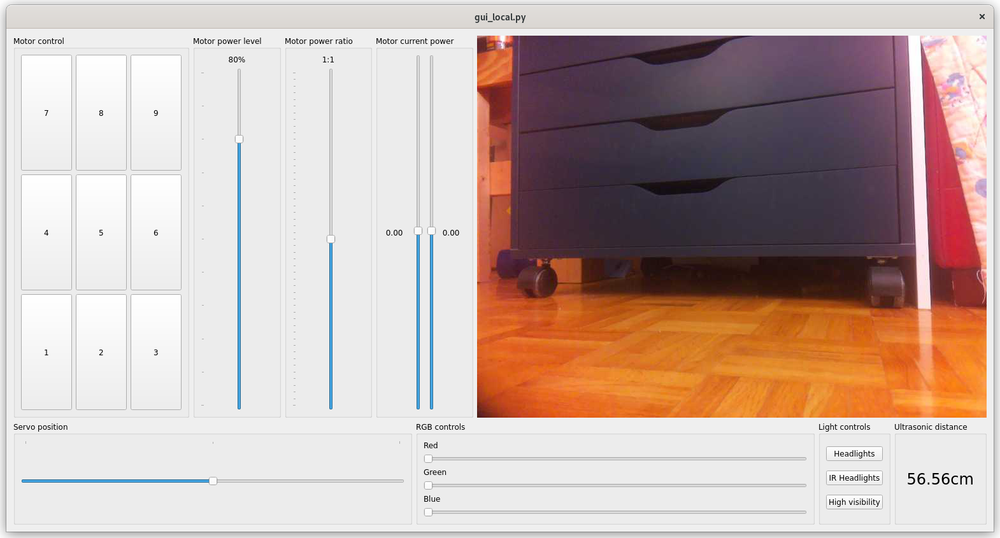

# TriloBot Controls

## Files

* controls_ssh.py A script you can run on the Raspberry Pi within an SSH session. It reads keyboard presses.
* fastapi_remote.py Run this on the Raspberry Pi to start a server to accept commands.
* gui_local.py A GUI app to run from your computer so that you can send commands to the API server.

