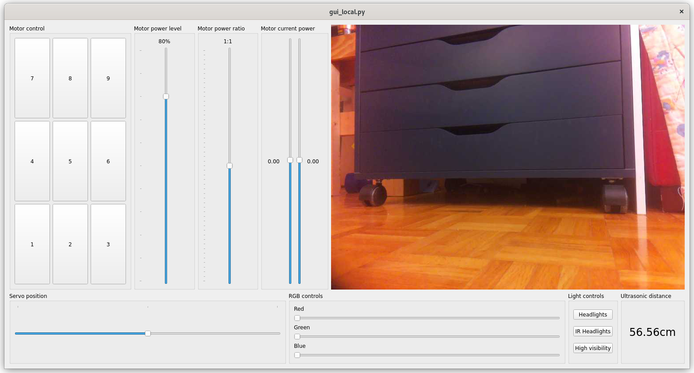

# TriloBot Controls

## Files

* fastapi_remote.py Run this on the Raspberry Pi to start a server to accept commands.
* gui_local.py A GUI app to run from your computer so that you can send commands to the API server.

## Dependencies

* [FastAPI](https://pypi.org/project/fastapi/) `pip install fastapi`
* [PIL](https://pypi.org/project/Pillow/) `pip install Pillow`
* [trilobot](https://github.com/pimoroni/trilobot-python) `pip3 install trilobot`

Optional

* [brightpi](https://github.com/PiSupply/Bright-Pi) headlights for the Trilobot, see link for installation
* [picamera2](https://github.com/raspberrypi/picamera2) access the Trilobot's camera from python, see link for installation

## Sample

